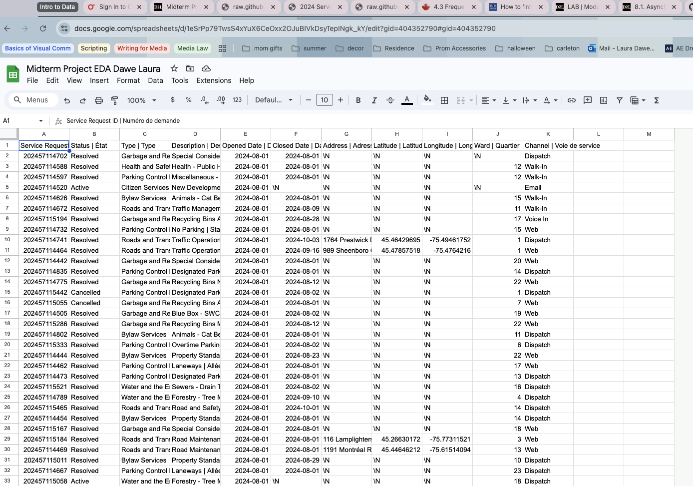
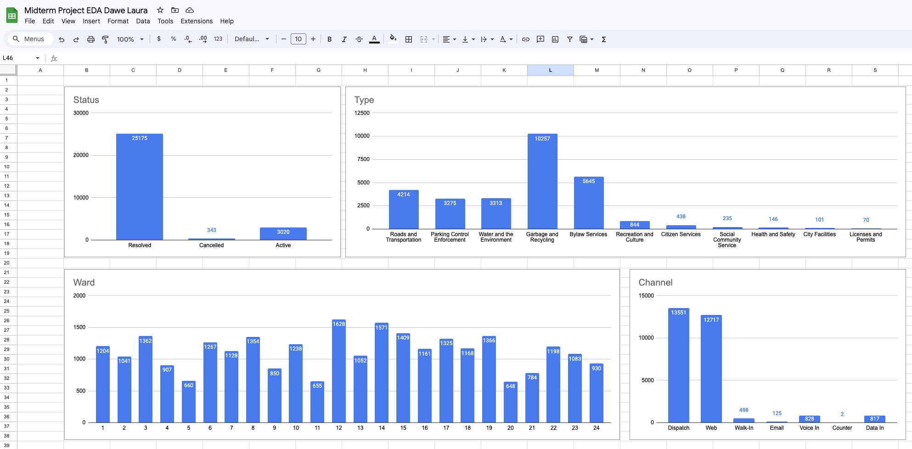
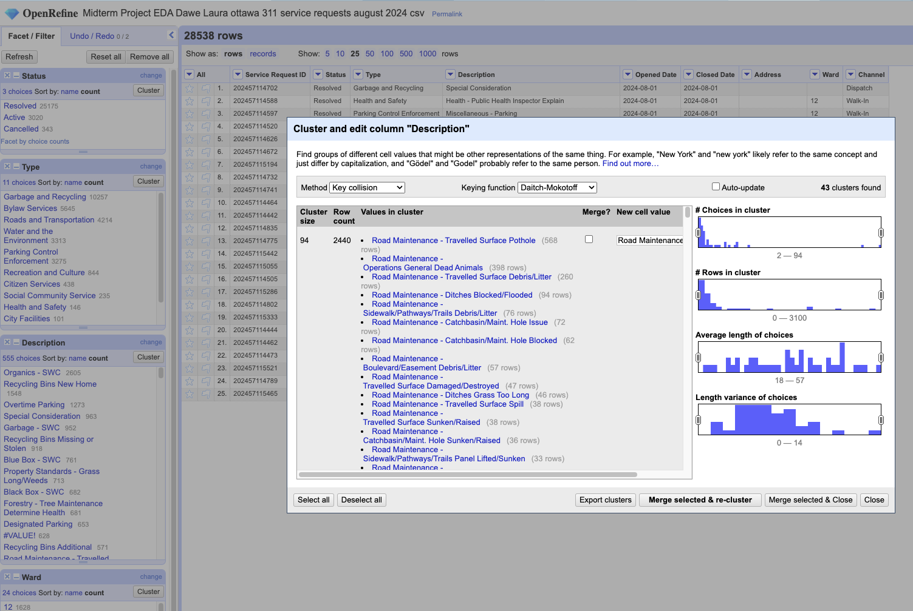
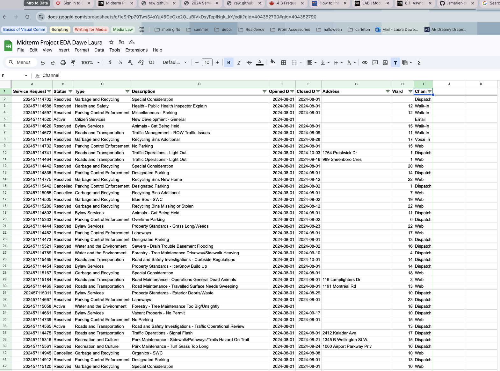
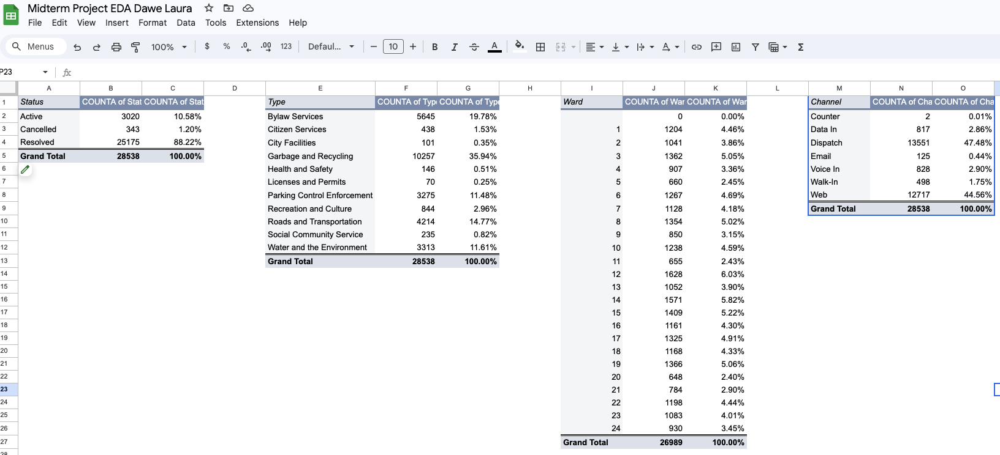
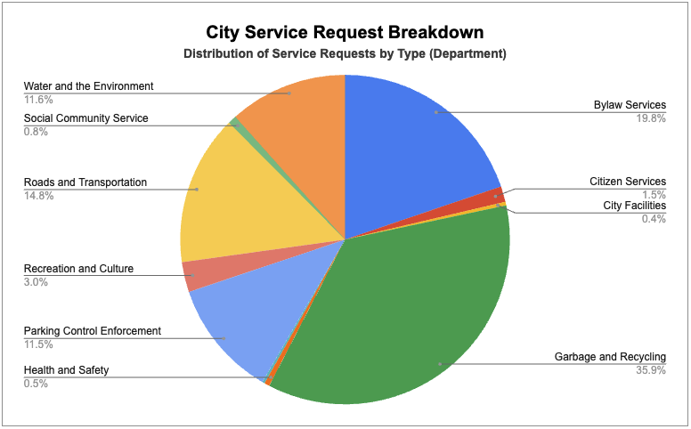

**Nov 3, 2024** 
**MPAD2003 - Introductory Data Storytelling** 
**Laura Dawe** 
**Presented to Jean-Sébastien Marier** 

# Midterm Project: Exploratory Data Analysis (EDA)

## Foreword

The City of Ottawa accepts service requests for activities that require action by city-led departments. A summary of requests for services, as well as associated data, is available to the public via the city’s open data portal. 
>"Data is presented by ward and shows the responsible City department and service request description." (City of Ottawa, 2023) (cite) https://open.ottawa.ca/

Analysis of the data can provide an indication of the issues and problems citizens encounter in the city. This project will use this data to identify potential stories that would be of interest to the community. 

## 1. Introduction

Putting into practice what has been learned in class, this project was to uncover insights, patterns, and trends with storytelling potential based on data taken from service calls to the City of Ottawa. The data was extracted from the City of Ottawa Open Data Portal and was a subset of data containing 28,539 entries covering the period between August 1 and September 1, 2024.

>Given that the source of the data was in raw format a crucial step in the process is to "...clean the data before using it for analysis which includes doing such things as correcting formatting, removing or correcting erroneous data, or something as simple a taking out an extra space." (Statistics Canada, 2021) (cite) https://www.statcan.gc.ca/wtc/data-literacy/journey

The methodology used to clean the data was primarily linear using a vimo analysis to correct or remove invalid data; google sheets tools to apply to refine the data set down to its essential elements, and; open refine to further summarise outputs for better identification. Analysis is quantitative, using numerical data counts to quantify patterns. While there was some feedback between analysis and data cleaning, there was not a significant amount of iteration. Pivot tables and charts are included to condense large amounts of data and to communicate it in a visual and easy to understand manner. 

The datasets used in this analysis:
* [City of Ottawa's open data portal *"2024 Service Requests"*](https://open.ottawa.ca/documents/65fe42e2502d442b8a774fd3d954cac5/about)
* [Sub-dataset (2024-08-01 to 2024-09-01) from Jean-Sébastien Marier Github repo](https://raw.githubusercontent.com/jsmarier/course-datasets/refs/heads/main/ottawa-311-service-requests-august-2024.csv)

This EDA report is comprised of the following sections:
1. Introduction
1. Getting Data
1. Understanding Data
    - VIMO analysis
    - Cleaning Data
    - Exploratory Data Analysis (EDA)
1. Potential Story
1. Conclusion
1. References

## 2. Getting Data

Google Sheets `File->Import` function was used to open the downloaded .csv dataset file from Github.  The seperator was defined as ','.  See resulting file in Fig. 1.

A link to the Google Sheet dataset is available here: https://docs.google.com/spreadsheets/d/1eSrPp79TwsS4xYuX6CeOxx2OJuBIVkDsyTepINgk_kY/edit?usp=sharing

**Obeservations:**

The dataset includes 28,540 entries/rows, excluding the row 1 headers.  There are 11 columns.
There are some obvious stange characters where blank cells would be expected.  There are lengthy, french language duplicates in many text fields making the spreadsheet difficult to read/analyze.  Therefore, some cleaning is definitly needed.

* Column C is nominal variable identifying the Type (Department) to which the request has been assigned.
* Column J is a nominal variable identifying the Ward from which the request orginated.
* Column E is a discrete variable containing the Opening Date when the request was assigned.
* Column K is a nominal variable identifying the Channel (means of communicating) used to report the request.

There is a significant amount of missing data in some of the columns, especially in the address, latitude, and longitude fields.  Latitude and longitude are surprising fields to find, are likely simply based on the address, and will provide little insight (unless a map-based study is desired.)  Also, the Service Request column provides minimal insight since it is just an id number, i.e. it does not quantify, order, nor encode worthwhile data.

**Questions/Hypothesis:**
1. Which department receives the most/least requests? 
1. Which wards generate the most/least requests?  
1. What is the most/least popular mode of reporting requests?
1. What is the usual duration (open time) of requests?

 
*Figure 1: Initial raw data import into Google Sheets.*

## 3. Understanding Data

### 3.1. VIMO Analysis

In order to perform a VIMO analysis, there can be some iteration between cleaning data and analyzing it for validity or correctness.  For example, auto-filter provides a valuable tool to identify missing data (blank fields) and was performed as part of the data cleaning process (See section 3.2 below).

>This piece of advice from Statscan applied: "Look at the range of values for key variables, ignoring the missing and invalid values, is the range and distribution of values realistic?...Do the variables make sense together.  (Statistics Canada, 20XX) (vimo video)

Subsequently, chart tools in Google Sheets were applied to key variables to determine the validity of the data.  See various charts in Fig. 2.  Looking into these charts, the summarized data values look to be valid for these types of variables.  Also, some potential story ideas may be apparent in these visualiztions.

The data is organized by Service Request, Type(Department), Description, Ward, and Channel amongst other factors such as time, location and status. The type of requests are organized by general areas such as garbage and recycling, parking, noise, maintenance, animals/pets, etc.

 
*Figure 2: Bar charts of key variables in Google Sheets.*

 

### 3.2. Cleaning Data

 

**There were several steps used to clean the data in Google Sheets.  The following is a record of the process taken to clean the data:**

 

*Deletion of Geographic Coordinates:*

I began by deleting the Latitude and Longitude columns as I did not feel this data was useful and these columns was also sparsely populated.

 

*Find and Replace:*

I used `Find and Replace` to find `\N` to be replaced with a blank field.  This was an example invalid entries or useless import data.

 

*Split Function:*

To remove `|` plus a duplicate French translation found in many text values, I used `=SPLIT(D2,”|”)` and copied this function down to all rows in Column E.

I then copied the first output column of the split function and pasted (values only) on to the original Column D.

 

This `SPLIT` function process was repeated as above for Column C.

 

*Find and Replace:*

I used `Find and Replace` to find `#VALUE!` to be replaced with a blank field.

This was to remove any erroneous data leftover from the split function.

 

*Manual Editing:*

I manually replaced `|` and French tranlations in Row 1 to remove duplicate information.

 

*Trim Whitespace:*

I used menu item: `Data -> Data Cleanup -> Trim Whitespace` on entire spreadsheet.

 

*Autofilter:*

I selected all cell in the spreadsheet and applied `Autofilter`.

I applied **Bold** font and used `View -> Freeze -> 1 Row` on Row 1 to improve readability and functionality.

 

*Remove/Correct Blank Cells/Rows:*

I used filter functions on Column A (Service Requests) to select `Blanks` and deleted two entirely blank rows.

 

*Sort Data:*

I used `Filter` again to sort Column E by date (A-Z sort) as the most useful ordered variable.

 

Using `File -> Download -> Comma Seperated Values(.csv)` a .csv file was downloaded to prepare data for use in OpenRefine.

--- 

**The data was further cleaned in OpenRefine:**

 

The .csv file was imported into OpenRefine and facets created for the columns of interest: *Status, Type, Description, Ward and Channel*.

I applied a cluster feature to the *Description* facet due to the field having many values that could be combined or treated as one.  This reduced the number of values from 555 to 142.

 

Many values that were expected to cluster were not identified by the open refine algorithm. As a result, it was difficult to make good use of portions of the data in the column or large manual effort would be required to combine similar data.

 

 
*Figure 2: OpenRefine facets and clustering tools.*

  

 
*Figure 3: Dataset after appling Google Sheets cleaning tools.*

 

### 3.3. Exploratory Data Analysis (EDA)

The most useful variables were determined to be: *Status, Type(Department), Ward, and Channel*.  These were chosen since they all could have potentially interesting data when shown as summary table with distribution.

 The *Description* variable was omitted due to too many distinct values. There are 555 unique values, or 142 with clustering.

A pivot table was performed for each of these variables of interest. The strategy here is to use the pivot table summary of the variable (with percent distribution) to highlight any interesting data features it might have. I based this on the following:

> Tables are very powerful when you are dealing with a relatively small number of data points. They show labels and amounts in the most structured and organized fashion and reveal their full potential when combined with the ability to sort and filter the data. (Cairo, 2016) (cite)

Each pivot table was generated using `Insert -> Pivot` table.  The data range of the column(variable) of interest must be selected. In the Pivot table editor, `Add` a `Row` choosing the header of the column.  Also, `Add`  two `Values` for same header using `COUNTA` option shown as Default and `% of grand total`.

The *Garbage and Recycling* percentage of Service Requests stands out since it represents a significantly larger portion, 35.94%, than the others.  I feel this would be a good candidate for futher analysis, where a good data story might be found.  There could be many stories relating to the distribution of its sub-cataogories like Blue vs. Black vs. Organic recycling, or other associated variable, eg. service calls by Ward.

Further, this one large catagory could warrant repeated EDA projects on its various sub-catagories, such as Ward distribution, Description(detailed requests) as well as extended research into costs, population, etc.

 

 
*Figure 4: This pivot table shows.*

>According to Cairo, a important part of visualization is: "always remembering that honesty, clarity, and depth come first." (Cairo, 2016)

 
*Figure 5: City Service Request Breakdown by Departmant*

## 4. Potential Story

To unlock a potential story idea, the following quote came to my mind: 

>"The process of visually exploring data can be summarized in a single sentence: find patterns and trends lurking in the data and then observe the deviations from those patterns. Interesting stories may arise from both the norm—also called the smooth—and the exceptions." (Cairo, 2016) (cite)

The *Garbage and Recycling* percentage of Service Requests as compared to other departments represent a significantly larger portion, 35.94%. I believe this variable holds a high potential for interesting data stories. One could imagine there are asscociated economical, environmental, and political aspects that would provide multiple avenues to explore.  

This story would be of high value and interest for the residents of the City of Ottawa given that the city’s plans to enforce new garbage limits in September 2024. It is probable that the upcoming restrictions may have altered the behavior and attitudes of residents as they prepare for the new regulations. The story could be focused on this particular aspect to highlight community reaction and perspectives. Interviews with residents across the city about their thoughts and reactions could support the story.

This story would touch on both human interest and municipal governance issues.

## 5. Conclusion

>In other words, you want to show the story of your data not just tell it. Visuals should take your audience on a journey of how the data changed over time or highlight the meaning behind the numbers. (video of visualizing GSheets, 20xx) (cite)

The quote above provides and accruate summary of  my thought process. I wanted to be able to find data that could tell a compelling story relavent to current events. It was gratifying to find that the results lined up to a very timely and contentious issue in the City of Ottawa.  I think this could have been an excellent opportunity to explore the mindset of our community as it pertains to one of our most significant urban problems.  

I found the most challenging aspect of this project to be the limitation of OpenRefine's clustering feature.  It was frustrating that seemingly obvious common descriptions were not identified as such, eg. the *Animal-* catagory.

I expected managing large datasets to be challenging but the tools available, primarily in Google Sheets, proved to be very powerful and easy to configure.  However, there were specific charts that I wasn't able to created as expected due to the complexities of its definition, eg. a stacked bar graph.

From a learning perspective, its given me confidence that large volume's of data can be reduced into digestable tables and visualizations providing the basis for a variety of data stories to naturally emerge.

## 6. References

Include a list of your references here. Please follow [APA guidelines for references](https://apastyle.apa.org/style-grammar-guidelines/references). Hanging paragraphs aren't required though.

**Here's an example:**

Bounegru, L., & Gray, J. (Eds.). (2021). *The Data Journalism Handbook 2: Towards A Critical Data Practice*. Amsterdam University Press. [https://ocul-crl.primo.exlibrisgroup.com/permalink/01OCUL_CRL/hgdufh/alma991022890087305153](https://ocul-crl.primo.exlibrisgroup.com/permalink/01OCUL_CRL/hgdufh/alma991022890087305153)
